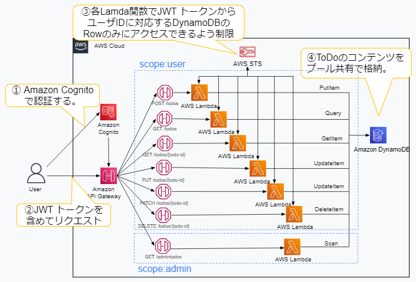
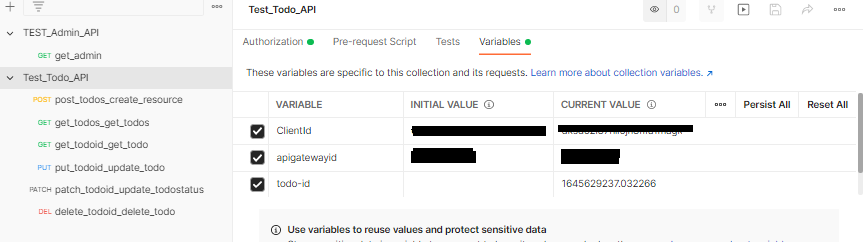
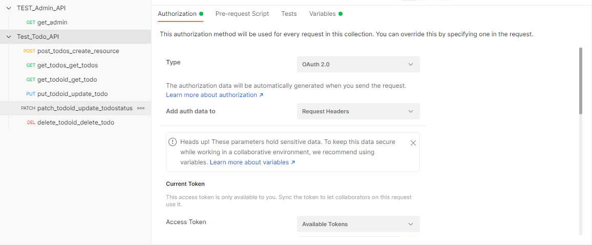
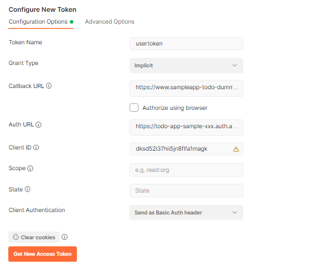
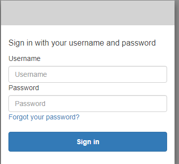
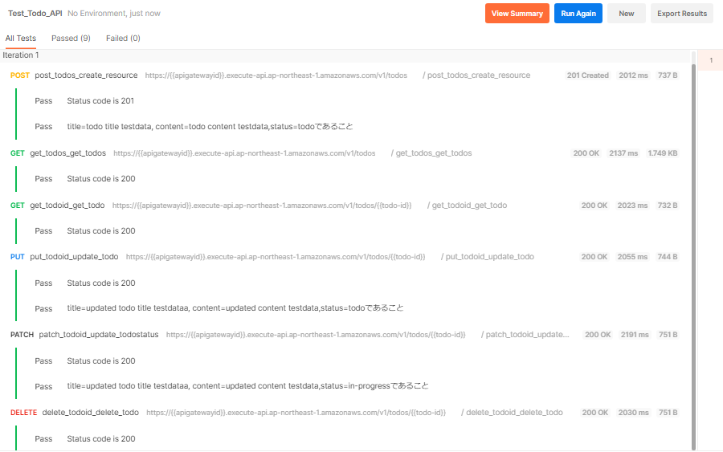
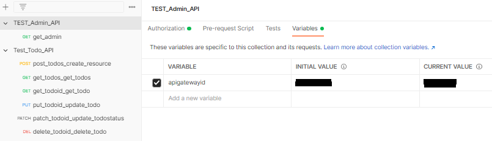
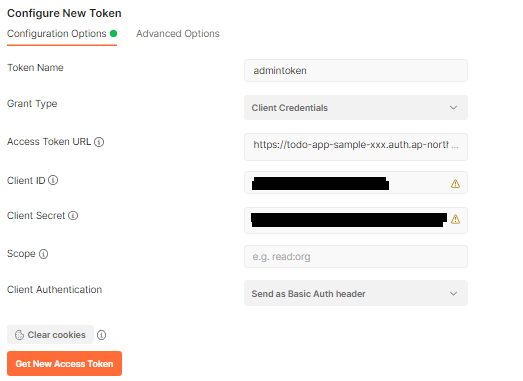
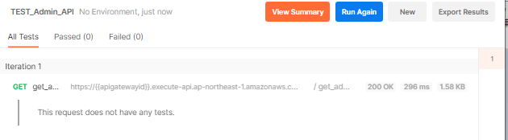

# todo-with-you
本リポジトリは、todoリスト用REST APIを実行するためのバックエンドを提供いたします。


バックエンドのインフラは、AWSで提供しており、AWS CDK（typescript）で記述しています。
また、バックエンドで実施する処理は、Lambdaで実現しており、Pythonで記述しています。

> **IMPORTANT:** 　利用にはAWSの利用料金が発生します。

## 概要
REST APIは、Amazon API Gatewayを用いてホストしており、オーソライザとしてAmazon Cognitoを使用しています。
REST APIの各メソッドの処理は、AWS Lambdaで実現し、データストアにAmazon DynamoDBを使用しています。

Amazon DynamoDBのテーブルインスタンスは全体で1つです。
行単位でアクセス制御を行うために、AWS Lambdaで受け取ったJWTトークンを基にして、条件キー「dynamodb:LeadingKeys」に制約をかけたIAMポリシを用いてDynamoDBにアクセスしています。

なお、Amazon API Gatewayの機能を用いて、APIドキュメントを作成しております。

## アーキテクチャ


## Getting Started

### 前提条件
 - git
 - AWS CLI
 - Node.js (≥ `14.15.0`)
   - npm  (>= `8.1.0`)
 - AWS CDK == `2.12.0`

 以下は、デプロイ後のREST APIのテストを行う際に必要に応じてインストール
 - (option) Postman(または newman)

### デプロイ方法

1. git clone https://github.com/insect-tjo/todo-with-you


2. スタックのデプロイ
```sh
npx cdk deploy --all
```

### テスト(CDK: Fine-grained assertions)
作成するAWSリソースに対する静的なチェックを行います。
（Lambdaの数、DynamoDBのスキーマなど）

```sh
npm run test
```

### テスト(Postman(またはClient REST)によるAPIのE2Eテスト)
REST APIに対するリクエストを発行し、認証を含めたE2Eの検証を実施します。

1. Cognito ユーザの作成(AWS CLI)
テスト用のユーザを作成します。

 `<user-rool-id>`は、デプロイしたCognito User PoolのIDに書き換えてください。

 例：ap-northeast-1_xxxxxxxxx

```sh
aws cognito-idp admin-create-user --user-pool-id "<user-rool-id>" --username testuser --user-attributes Name=email,Value="test@test.com" Name=email_verified,Value=true --message-action SUPPRESS
```

2. Cognito テストユーザのパスワード変更
テスト用ユーザのパスワードを設定します。

`<user-rool-id>`は、1.と同様のCognito User PoolのIDに書き換えてください。\
`<password>` は、任意のパスワードを入力ください。（後で使用します。）


```sh
aws cognito-idp admin-set-user-password --user-pool-id "<user-pool-id>" --username testuser --password <password> --permanent 
```
3. PostManの変数設定(ユーザ向けAPIの検証)

PostManでシナリオ(test/Test_Todo_API.postman_collection.json)をインポートします。


次に、コレクション「Test_Todo_API」をクリックし、Variablesタブを開きます。\
ここで、デプロイした環境に合わせてINITIAL VALUEを入力します。\
各パラメータの示す値は以下の通りです。

| VARIABLE       | 概要                       |
| -------------- | -------------------------- |
| `ClientId`     | Cognito User pool に紐づいているアプリクライアントのクライアントID |
| `apigatewayid` | Amazon API gatewayのID（例：f645hxxxxx）  |

なお、`todo-id` はシナリオ実行中に取得するため、入力不要です。



4. 認証トークン取得(ユーザ向けAPIの検証)

コレクション「Test_Todo_API」をクリックし、「Authorization」タブをクリックします。

`Type`は、[OAuth 2.0]を選択し、\
`Add auth data to`は、「Request Headers」を選択します。



`Token Name`には、任意のトークン名を入力し、\
`Grant Type`は、Implicitを選択、\
`Callback URL`は、「UserPooltodoUserClient*」で始まるCognito アプリクライアントで許可しているコールバックURLを入力してください。\
`Auth URL`は、<Cognitoドメイン>/loginとしてください。\
例）https://todo-app-sample-xxxxx.auth.ap-northeast-1.amazoncognito.com/login
\
`Client ID`は「UserPooltodoUserClient*」で始まるCognito アプリクライアントのIDを入力し、\
`Client Authentication`は、Send as Basic Auth header としてください。\
その後、「Get New Access Token」をクリックしてください。




ログイン画面が表示されるので、
1、 2 で作成したユーザ名、パスワードでログインください。


5. PostManのテストシナリオ実行(ユーザ向けAPIの検証)

テストを実行します。\
「Test_Todo_API」の右側にある「・・・」→「Run collection」の順にクリックします。
その後、表示されるウィンドウで何も変更せずに、「Run Test_Todo_API」をクリックします。


以下のように、全てのケースで「Pass」となれば成功です。



6. PostManの変数設定(管理者向けAPIの検証)
PostManでシナリオ(test/Test_Admin_API.postman_collection.json)をインポートします。

次に、コレクション「Test_Admin_API」をクリックし、Variablesタブを開きます。\
ここで、デプロイした環境に合わせてINITIAL VALUEを入力します。\
各パラメータの示す値は以下の通りです。

| VARIABLE       | 概要                       |
| -------------- | -------------------------- |
| `apigatewayid` | Amazon API gatewayのID（例：f645hxxxxx）  |



7. 認証トークン取得(管理者向けAPIの検証)

4.と同様にコレクション「Test_Admin_API」のAuthorizationタブを開きます。\
`Type`は、[OAuth 2.0]を選択し、\
`Add auth data to`は、「Request Headers」を選択します。\

`Token Name`には、任意のトークン名を入力し、\
`Grant Type`は、Client Credentialsを選択、\
`Access Token URL`は、<Cognitoドメイン>/oauth2/tokenとしてください。\
例）https://todo-app-sample-xxxxx.auth.ap-northeast-1.amazoncognito.com/oauth2/token
\
`Client ID`は「UserPooltodoAdminClient*」で始まるCognito アプリクライアントのIDを入力し、\
`Client Authentication`は、Send as Basic Auth header としてください。\

その後、「Get New Access Token」をクリックしてください。




8. PostManのテストシナリオ実行(ユーザ向けAPIの検証)

5.と同様に実行し、
以下のように、全てのケースで「Pass」となれば成功です。


## clean up
1. スタックの削除
```sh
npx cdk destroy --all
```
> **IMPORTANT:** Amazon Cognito Userpoolも削除されます。


## デプロイされるAPIの仕様

### APIの概要

| リソース          | メソッド |概要                   |
| --------------   | -------- |-----------------------|
| /todos           | POST     | ToDoを作成する。       |
| /todos           | GET      | ログインユーザのToDo一覧を取得する。  |
| /todos/{todo-id} | GET      | 特定のToDoを取得する。 |
| /todos/{todo-id} | PUT      | 特定のToDoを更新する。 |
| /todos/{todo-id} | PATCH    | 特定のToDoを更新する。（ToDoの持つ状態のみを更新） |
| /todos/{todo-id} | DELETE   | 特定のToDoを削除する。 |
| /admintodos      | GET   | 全ユーザのToDoの一覧を取得する。 |
#### /todos POST 
ToDoを作成する。

 - リクエスト

| パラメータ種別   | パラメータ名(key) |値(value)               |
| --------------  | ----------------- |-----------------------|
| リクエストヘッダ | Authorization     | Cognitoでの認証時に払いだされるJWTトークン（IDトークン）  |
| リクエストボディ | title             | ToDoのタイトル        |
| リクエストボディ | content           | ToDoの内容            |


 - レスポンス

| パラメータ種別    | パラメータ名(key) |値(value)               |
| --------------   | ----------------- |-----------------------|
| レスポンスボディ  | title             | 生成したToDoのタイトル  |
| レスポンスボディ  | content           | 生成したToDoの内容      |
| レスポンスボディ  | status            | 生成したToDoの状態（初期値として、”todo”を返す）  |
| レスポンスボディ  | userid            | ToDoを生成したユーザのID      |
| レスポンスボディ  | todoid            | 生成したToDoのID      |

#### /todos GET
ToDoの一覧を取得する。

 - リクエスト

| パラメータ種別   | パラメータ名(key) |値(value)               |
| --------------  | ----------------- |-----------------------|
| リクエストヘッダ | Authorization     | Cognitoでの認証時に払いだされるJWTトークン（IDトークン）  |


 - レスポンス

| パラメータ種別    | パラメータ名(key) |値(value)               |
| --------------   | ----------------- |-----------------------|
| レスポンスボディ  | title             | 生成したToDoのタイトル  |
| レスポンスボディ  | content           | 生成したToDoの内容      |
| レスポンスボディ  | status            | 生成したToDoの状態（初期値として、”todo”を返す）  |
| レスポンスボディ  | userid            | ToDoを生成したユーザのID      |
| レスポンスボディ  | todoid            | 生成したToDoのID      |

※全てのToDoを一覧で返す。最大30個。


#### /todos/{todo-id} GET  
ToDoを取得する。

 - リクエスト

| パラメータ種別   | パラメータ名(key) |値(value)               |
| --------------  | ----------------- |-----------------------|
| リクエストヘッダ | Authorization     | Cognitoでの認証時に払いだされるJWTトークン（IDトークン）  |
| リクエストボディ | todoid            | 取得するToDoのID      |


 - レスポンス

| パラメータ種別    | パラメータ名(key) |値(value)               |
| --------------   | ----------------- |-----------------------|
| レスポンスボディ  | title             | 生成したToDoのタイトル  |
| レスポンスボディ  | content           | 生成したToDoの内容      |
| レスポンスボディ  | status            | 生成したToDoの状態（初期値として、”todo”を返す）  |
| レスポンスボディ  | userid            | ToDoを生成したユーザのID      |
| レスポンスボディ  | todoid            | 生成したToDoのID      |


#### /todos/{todo-id} PUT
ToDoを更新する。

 - リクエスト

| パラメータ種別   | パラメータ名(key) |値(value)               |
| --------------  | ----------------- |-----------------------|
| リクエストヘッダ | Authorization     | Cognitoでの認証時に払いだされるJWTトークン（IDトークン）  |
| パスパラメータ  | {todo-id}          | todoidを指定する。      |
| リクエストボディ | title             | 更新後のToDoのタイトル  |
| リクエストボディ | content           | 更新後のToDoの内容  |
| リクエストボディ  | status           | 更新後のToDoの状態  |

 - レスポンス

| パラメータ種別    | パラメータ名(key) |値(value)               |
| --------------   | ----------------- |-----------------------|
| レスポンスボディ  | title             | 更新後のToDoのタイトル  |
| レスポンスボディ  | content           | 更新後のToDoの内容      |
| レスポンスボディ  | status            | 更新後のToDoの状態  |
| レスポンスボディ  | userid            | ToDoのユーザID      |
| レスポンスボディ  | todoid            | ToDoのID      |

#### /todos/{todo-id} PATCH
ToDoのstatusのみを更新する。

 - リクエスト

| パラメータ種別   | パラメータ名(key) |値(value)               |
| --------------  | ----------------- |-----------------------|
| リクエストヘッダ | Authorization     | Cognitoでの認証時に払いだされるJWTトークン（IDトークン）  |
| パスパラメータ  | {todo-id}          | todoidを指定する。      |
| リクエストボディ  | status           | 更新後のToDoの状態  |

 - レスポンス

| パラメータ種別    | パラメータ名(key) |値(value)               |
| --------------   | ----------------- |-----------------------|
| レスポンスボディ  | title             | 更新後のToDoのタイトル  |
| レスポンスボディ  | content           | 更新後のToDoの内容      |
| レスポンスボディ  | status            | 更新後のToDoの状態  |
| レスポンスボディ  | userid            | ToDoのユーザID      |
| レスポンスボディ  | todoid            | ToDoのID      |

#### /todos/{todo-id} DELETE
ToDoを削除する。

 - リクエスト

| パラメータ種別   | パラメータ名(key) |値(value)               |
| --------------  | ----------------- |-----------------------|
| リクエストヘッダ | Authorization     | Cognitoでの認証時に払いだされるJWTトークン（IDトークン）  |
| パスパラメータ  | {todo-id}          | todoidを指定する。      |

 - レスポンス

| パラメータ種別    | パラメータ名(key) |値(value)               |
| --------------   | ----------------- |-----------------------|
| レスポンスボディ  | title             | 削除したToDoのタイトル  |
| レスポンスボディ  | content           | 削除したToDoの内容      |
| レスポンスボディ  | status            | 削除したToDoの状態  |
| レスポンスボディ  | userid            | 削除したToDoのユーザID      |
| レスポンスボディ  | todoid            | 削除したToDoのID      |


#### /admintodos GET
全ユーザのToDoの一覧を取得する。

 - リクエスト

| パラメータ種別   | パラメータ名(key) |値(value)               |
| --------------  | ----------------- |-----------------------|
| リクエストヘッダ | Authorization     | Cognitoでの認証時に払いだされるJWTトークン（IDトークン）  |


 - レスポンス

| パラメータ種別    | パラメータ名(key) |値(value)               |
| --------------   | ----------------- |-----------------------|
| レスポンスボディ  | title             | 生成したToDoのタイトル  |
| レスポンスボディ  | content           | 生成したToDoの内容      |
| レスポンスボディ  | status            | 生成したToDoの状態（初期値として、”todo”を返す）  |
| レスポンスボディ  | userid            | ToDoを生成したユーザのID      |
| レスポンスボディ  | todoid            | 生成したToDoのID      |

※全てのToDoを一覧で返す。