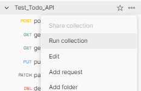

# todo-with-you
本リポジトリは、todoリスト用REST APIを実行するためのバックエンドを提供いたします。


バックエンドのインフラは、AWSで提供しており、AWS CDK（typescript）で記述しています。
また、バックエンドで実施する処理は、Lambdaで実現しており、Pythonで記述しています。

> **IMPORTANT:** 　利用にはAWSの利用料金が発生します。

## 概要
REST APIは、Amazon API Gatewayを用いてホストしており、オーソライザとしてAmazon Cognitoを使用しています。
REST APIの各メソッドの処理は、AWS Lambdaで実現し、データストアにAmazon DynamoDBを使用しています。

Amazon DynamoDBのテーブルインスタンスは全体で1つです。
行単位でアクセス制御を行うために、AWS Lambdaで受け取ったJWTトークンを基にして、条件キー「dynamodb:LeadingKeys」に制約をかけたIAMポリシを用いてDynamoDBにアクセスしています。

なお、Amazon API Gatewayの機能を用いて、APIドキュメントを作成しております。

## アーキテクチャ


## Getting Started

### 前提条件
 - git
 - AWS CLI
 - Node.js (≥ `14.15.0`)
   - npm  (>= `8.1.0`)
 - AWS CDK == `2.12.0`

 以下は、デプロイ後のREST APIのテストを行う際に必要に応じてインストール
 - (option) Postman(または newman)

### デプロイ方法

1. git clone https://github.com/insect-tjo/todo-with-you


2. constructのインストール
```sh
npm i -s @aws-solutions-constructs/aws-cognito-apigateway-lambda
```

3. スタックのデプロイ
```sh
cdk deploy --all
```

### テスト(CDK: Fine-grained assertions)
作成するAWSリソースに対する静的なチェックを行います。
（Lambdaの数、DynamoDBのスキーマなど）

```sh
npm run stest
```

### テスト(Postman(またはClient REST)によるAPIのE2Eテスト)
REST APIに対するリクエストを発行し、認証を含めたE2Eの検証を実施します。

1. Cognito ユーザの作成(AWS CLI)
テスト用のユーザを作成します。

 `<user-rool-id>`は、デプロイしたCognito User PoolのIDに書き換えてください。

 例：ap-northeast-1_xxxxxxxxx

```sh
aws cognito-idp admin-create-user --user-pool-id "<user-rool-id>" --username testuser --user-attributes Name=email,Value="test@test.com" Name=email_verified,Value=true --message-action SUPPRESS
```

2. Cognito テストユーザのパスワード変更
テスト用ユーザのパスワードを設定します。

`<user-rool-id>`は、1.と同様のCognito User PoolのIDに書き換えてください。\
`<password>` は、任意のパスワードを入力ください。（後で使用します。）


```sh
aws cognito-idp admin-set-user-password --user-pool-id "<user-rool-id>" --username testuser --password <password> --permanent 
```
3. PostManのパラメータ設定

PostManでシナリオ(test/Test_Todo_API.postman_collection.json)をインポートします。


次に、コレクション「Test_Todo_API」をクリックし、Variablesタブを開きます。\
ここで、デプロイした環境に合わせてINITIAL VALUEを入力します。\
各パラメータの示す値は以下の通りです。

| VARIABLE       | 概要                       |
| -------------- | -------------------------- |
| `ClientId`     | Cognito User pool に紐づいているアプリクライアントのクライアントID |
| `username`     | 1. 2. で作成したテストユーザのユーザ名   |
| `password`     | 1. 2. で作成したテストユーザのパスワード   |
| `apigatewayid` | Amazon API gatewayのID（例：f645hxxxxx）  |

なお、`idtoken` , `todo-id` はシナリオ実行中に取得するため、入力不要です。


4. PostManのテストシナリオ実行

テストを実行します。\
「Test_Todo_API」の右側にある「・・・」→「Run collection」の順にクリックします。
その後、表示されるウィンドウで何も変更せずに、「Run Test_Todo_API」をクリックします。




以下のように、全てのケースで「Pass」となれば成功です。


## clean up
1. スタックの削除
```sh
cdk destroy --all
```
> **IMPORTANT:** Amazon Cognitoは削除しない設定にしている。
 (todo:Amazon Cognitoの削除ポリシを変更。 )


## 使い方(API)
T.B.D.


